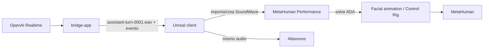

# Evaluacion de ruta lipsync con MetaHuman ADA

## Objetivo

Determinar la mejor forma de animar el MetaHuman con el audio generado por OpenAI Realtime para una demo de podcast local donde:

- la voz del invitado se genera en tiempo casi real
- la sincronizacion voz-cara importa mas que la latencia minima
- ya existe un bridge que recibe audio PCM del modelo
- el resultado debe verse natural en una grabacion, no necesariamente soportar interrupciones agresivas

## Resumen ejecutivo

Para este proyecto recomiendo:

1. usar **Audio Driven Animation a partir de SoundWave/MetaHuman Performance** como ruta principal del MVP
2. dejar **MetaHuman Audio Live Link** como ruta alternativa si despues buscamos streaming facial mas inmediato

Motivo principal:

- la documentacion oficial de Epic separa claramente la via **realtime por Live Link desde una fuente de audio** de la via **Audio Driven Animation con SoundWave en MetaHuman Performance**
- para tu demo, el audio del modelo ya nace como datos digitales en el bridge, asi que convertir cada respuesta del asistente en un clip/asset controlado dentro de Unreal encaja mejor con el requisito de sincronizacion estable
- aceptas unos milisegundos extra si la sincronizacion queda mejor

## Las dos rutas oficiales relevantes

### Opcion A: MetaHuman Audio Live Link

Epic documenta una ruta de **Realtime Animation** donde el MetaHuman se anima desde una fuente de audio en tiempo real usando Live Link.

Puntos clave de la documentacion:

- requiere Unreal Engine 5.6 o superior
- requiere el plugin **MetaHuman Live Link**
- se crea una fuente **MetaHuman (Audio)** en la ventana Live Link
- la entrada es un **audio device**

Esta es la ruta correcta si quieres:

- animacion facial realmente continua en streaming
- menor latencia visual posible
- usar una fuente de audio que Unreal pueda ver como dispositivo

### Opcion B: Audio Driven Animation con SoundWave

Epic documenta tambien la ruta **Audio Driven Animation** con **MetaHuman Performance**.

Puntos clave de la documentacion:

- requiere Unreal Engine 5.6 o superior
- requiere el plugin **MetaHuman Animator**
- acepta audio como **SoundWave**
- puede ejecutarse con **realtime audio solve**, pero Epic aclara que sigue siendo parte del flujo offline y es distinto de la ruta Live Link
- cuando activas `realtime audio`, mejora latencia de solve pero se pierde movimiento de cabeza
- existe un `process mask` para generar cara completa o solo curvas relacionadas con la boca

Esta ruta es la mejor si quieres:

- usar exactamente el audio ya generado por tu sistema
- procesar cada respuesta del invitado como una unidad controlada
- mantener voz y animacion bloqueadas al mismo clip
- exportar o depurar facilmente cada utterance

## Recomendacion para este MVP

### Ruta elegida

Recomiendo **SoundWave + MetaHuman Performance + realtime audio solve por utterance**, no Live Link Audio como primera implementacion.

### Por que esta ruta encaja mejor aqui

1. **El audio del invitado ya existe como salida del bridge.**

   No estamos capturando una interpretacion humana con micro directo hacia MetaHuman. Estamos recibiendo chunks PCM de OpenAI. Convertir eso a un clip controlado dentro de Unreal es mas natural que fingir un micro fisico.

2. **Quieres sincronizacion creible por encima de latencia minima.**

   Si esperamos a tener una respuesta o subrespuesta suficientemente estable, podemos reproducir el audio y disparar la animacion con el mismo material. Eso reduce drift.

3. **El bridge ya guarda WAV por utterance.**

   `DE-03` deja guardado `assistant-turn-XXXX.wav`. Eso encaja directamente con la ruta de SoundWave/Performance y evita meter desde ya dispositivos virtuales de audio o loopback del sistema.

4. **La demo es grabable, no una llamada ultrabaja en latencia.**

   En este contexto, 300-800 ms extra al arrancar un turno pueden ser aceptables si el resultado se ve mucho mas solido.

## Arquitectura recomendada para la integracion

## Flujo recomendado en Unreal

### Fase 1: prueba robusta por respuesta completa

1. El bridge termina una respuesta del asistente.
2. Guarda `assistant-turn-XXXX.wav`.
3. Envia a Unreal un evento con la ruta del WAV.
4. Unreal crea o actualiza un `SoundWave`.
5. Unreal procesa ADA para ese clip.
6. Unreal reproduce audio y animacion de forma coordinada.

Ventajas:

- integracion mas simple
- depuracion facil
- sincronizacion mas fiable

Desventajas:

- mas latencia al inicio del turno

### Fase 2: near-real-time por subfrases

Si la fase 1 funciona y la latencia te parece demasiado alta:

1. el bridge agrupa audio en trozos mas largos que un chunk suelto, por ejemplo 500-1500 ms
2. Unreal procesa subclips encadenados
3. el avatar habla con menor espera inicial

Esto es mas complejo y puede introducir artefactos entre segmentos, asi que no lo pondria primero.

## Cuando si elegiria Live Link Audio

Usaria **MetaHuman Audio Live Link** si se cumple alguno de estos puntos:

- quieres animacion realmente continua mientras aun se esta generando la respuesta
- aceptas mayor complejidad de sistema para enrutar audio a un dispositivo virtual
- vas a priorizar sensacion de inmediatez sobre precision de cada utterance

En ese caso, la ruta probable seria:

1. el bridge o Unreal envian el audio del invitado a un dispositivo virtual de audio
2. Unreal crea una fuente `MetaHuman (Audio)` apuntando a ese dispositivo
3. Live Link alimenta al MetaHuman en tiempo real

Riesgos de esa ruta:

- dependencia de drivers o virtual audio cable
- debugging mas dificil
- mas puntos donde puede aparecer drift entre lo que oye el usuario y lo que usa la animacion

## Plugins y assets necesarios

### Para Live Link Audio

- plugin **MetaHuman Live Link**
- ventana **Live Link**
- fuente **MetaHuman (Audio)**
- MetaHuman ya ensamblado en Unreal

### Para ADA con SoundWave

- plugin **MetaHuman Animator**
- asset **MetaHuman Performance**
- un **SoundWave** por respuesta o subrespuesta
- face mesh / visualization mesh del MetaHuman

### Automatizacion posible

Epic documenta scripts de Python de ejemplo dentro del plugin para procesar audio:

- `\Engine\Plugins\MetaHuman\MetaHumanAnimator\Content\Python\process_audio_performance.py`

Esto es importante para nosotros porque permite convertir `assistant-turn-XXXX.wav` en una via automatizable para `IN-02`, y mas adelante incluso para batch o tooling interno.

## Latencia recomendada

No hay un numero oficial unico de Epic para "latencia ideal", pero la documentacion si deja claro el tradeoff:

- `realtime_audio_lookahead` mas alto = mejor calidad
- `realtime_audio_lookahead` mas alto = mas latencia

Para este MVP yo haria esta estrategia:

- `250-400 ms` de buffer inicial en el bridge
- primer intento de ADA por **respuesta completa**
- si la espera visual es demasiada, bajar a **subfrases de 0.5-1.5 s**

Mi inference para este proyecto:

- por debajo de ~200 ms es facil que el pipeline completo bridge -> Unreal -> ADA sea fragil
- alrededor de `300-800 ms` de espera al inicio del turno puede seguir viendose natural en una demo tipo podcast si luego la sincronizacion es buena

Esto es una inferencia de integracion, no una cifra oficial de Epic.

## Decisiones concretas para IN-01 e IN-02

### IN-01

El bridge debe enviar a Unreal:

- evento `assistant.response_finished`
- ruta del `wavPath`
- transcript final
- sample rate y metadatos basicos

### IN-02

Primera implementacion:

- consumir el WAV final de cada respuesta
- importarlo/crearlo como `SoundWave`
- procesarlo con `MetaHuman Performance`
- reproducir audio y animacion en un mismo punto de control dentro de Unreal

Segunda implementacion opcional:

- experimentar con subclips o una ruta Live Link Audio si la latencia percibida no es suficiente

## Conclusiones

### Ruta recomendada

**Audio Driven Animation con SoundWave** es la mejor ruta para este MVP.

### Ruta no recomendada como primera integracion

**MetaHuman Audio Live Link** no la descarto, pero no la pondria primero porque obliga a resolver antes el problema del dispositivo de audio virtual y complica la trazabilidad de la sincronizacion.

### Que validaria despues

1. que Unreal pueda consumir sin friccion los WAV que ya guarda el bridge
2. que el solve ADA por respuesta completa se vea suficientemente natural
3. si la latencia visual molesta, probar subfrases antes de saltar a Live Link Audio

## Fuentes oficiales

- Epic MetaHuman Realtime Animation: https://dev.epicgames.com/documentation/en-us/metahuman/realtime-animation?application_version=5.6
- Epic Using a MetaHuman Audio Source: https://dev.epicgames.com/documentation/en-us/metahuman/using-a-metahuman-audio-source
- Epic Audio Driven Animation: https://dev.epicgames.com/documentation/en-us/metahuman/audio-driven-animation
- Epic Python Scripting for MetaHuman Animator: https://dev.epicgames.com/documentation/en-us/metahuman/python-scripting
- Unreal Python API `MetaHumanPerformance`: https://dev.epicgames.com/documentation/en-us/unreal-engine/python-api/class/MetaHumanPerformance?application_version=5.7
