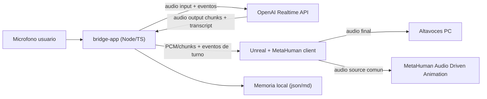

# Arquitectura MVP: podcast con invitado IA + MetaHuman

## Objetivo

Construir una demo local en Windows donde:

- el usuario habla por microfono
- OpenAI Realtime genera la respuesta en voz
- un MetaHuman en Unreal actua como invitado del podcast
- la cara del avatar se anima con el mismo audio que oye el usuario
- el sistema guarda memoria resumida entre sesiones

## Decisiones principales

### 1. Arquitectura en dos piezas

El MVP se divide en dos procesos:

1. `bridge-app` local en Windows
2. `unreal-client` dentro del proyecto Unreal

Motivo:

- separa red, audio y estado de sesion de la logica de Unreal
- permite probar Realtime sin depender del editor
- facilita depuracion y reintentos
- reduce el acoplamiento temprano con Blueprints/C++

### 2. Conexion OpenAI por WebSocket desde el bridge

Recomendacion para el MVP: el `bridge-app` se conecta a OpenAI Realtime por WebSocket, no por WebRTC.

Motivo:

- OpenAI recomienda WebRTC para clientes browser/mobile.
- OpenAI documenta WebSocket como buena opcion para integraciones server-to-server.
- En este proyecto el bridge local actua como backend local de confianza y necesita control directo sobre los chunks de audio para reutilizarlos en Unreal.

Esto es una inferencia de arquitectura basada en la documentacion oficial, no una obligacion del producto.

### 3. Unreal debe ser la fuente final de reproduccion del invitado

Para mantener sincronia creible entre voz y cara:

- el bridge recibe el audio del modelo
- Unreal reproduce el audio del invitado por los altavoces del PC
- el mismo audio reproducido en Unreal se usa para animar el MetaHuman

Durante una fase temprana de desarrollo, el bridge puede reproducir audio por si solo para pruebas. Pero en la integracion real, la reproduccion final debe vivir en Unreal para evitar drift entre audio y animacion.

### 4. Memoria persistente fuera de Realtime

La sesion realtime debe mantenerse ligera. La memoria persistente vivira en archivos locales legibles.

Se guardaran:

- transcripcion por sesion
- resumen por sesion
- resumen acumulado del personaje y de conversaciones previas

Al arrancar una sesion nueva, el bridge cargara un resumen corto y estable en vez de reenviar historiales largos.

## Arquitectura propuesta



## Responsabilidades por componente

### A. `bridge-app`

Responsabilidades:

- capturar audio del microfono del usuario
- abrir y mantener la sesion con OpenAI Realtime
- enviar audio del usuario en chunks
- recibir audio del modelo en chunks
- reconstruir transcript y eventos de turno
- aplicar logica de sesion, interrupciones y errores
- exponer audio/eventos al cliente de Unreal
- persistir transcripciones y resumenes

Responsabilidades que no debe asumir en la version integrada:

- renderizar avatar
- ser la salida final de audio del invitado
- decidir logica visual de animacion facial

### B. `unreal-client`

Responsabilidades:

- conectarse al bridge local
- recibir eventos de estado y audio del invitado
- reproducir el audio del invitado
- alimentar MetaHuman Audio Driven Animation con ese audio
- reflejar estados visuales basicos: escuchando, pensando, hablando, error

### C. `OpenAI Realtime`

Responsabilidades:

- detectar turnos por voz si usamos VAD
- transcribir audio de entrada si se activa
- generar la respuesta del invitado en audio
- emitir transcript parcial/final y audio de salida

## Flujo de una conversacion

### Inicio de sesion

1. El bridge carga configuracion local.
2. El bridge lee memoria persistida.
3. El bridge abre una sesion Realtime con instrucciones del personaje.
4. El bridge inyecta resumen corto del historial como contexto inicial.
5. Unreal se conecta al bridge y queda esperando eventos.

### Turno del usuario

1. El bridge captura audio del microfono.
2. El bridge envia chunks a Realtime.
3. Realtime detecta inicio y fin de voz si VAD esta activo.
4. Cuando termina el turno del usuario, Realtime prepara la respuesta.

### Turno del invitado

1. El bridge recibe `response.output_audio.delta`.
2. El bridge mete esos chunks en un jitter buffer corto.
3. Cuando hay suficiente audio bufferizado para evitar cortes, el bridge empieza a reenviarlo a Unreal.
4. Unreal reproduce ese audio y lo usa como fuente del lipsync/ADA.
5. Al terminar la respuesta, el bridge cierra el utterance y guarda transcript + metadatos.

### Cierre de sesion

1. El bridge guarda transcripcion cruda.
2. El bridge genera o actualiza un resumen persistente.
3. Se guarda un resumen corto apto para reinyectar en sesiones futuras.

## Politica de audio y sincronizacion

### Fuente unica de verdad

El audio que oye el usuario y el audio que usa el MetaHuman deben salir del mismo stream en Unreal.

No se recomienda:

- reproducir una copia en el bridge y otra distinta en Unreal
- regenerar el audio para animacion por una via separada

### Buffer de salida

Se recomienda un buffer corto de salida en el bridge, por ejemplo 200-400 ms al inicio de cada turno del invitado.

Objetivo:

- reducir clicks y underruns
- dar margen a Unreal para consumir audio con estabilidad
- mantener una latencia aceptable para una demo conversacional

Tu requisito de "puedo esperar unos ms mas si la sincronia queda mejor" encaja bien con esta estrategia.

### Interrupciones

Para la primera demo, recomiendo una politica conservadora:

- modo conversacional semi-duplex
- mientras habla el invitado, no intentamos barge-in agresivo
- si el usuario interrumpe, paramos audio y truncamos la respuesta solo en una iteracion posterior

Motivo:

- la documentacion Realtime permite interrupciones y truncado, pero eso aumenta complejidad de sincronia
- para una demo grabable, priorizamos estabilidad sobre sofisticacion

## Contrato bridge -> Unreal

El bridge debe exponer dos canales locales:

### 1. Canal de control

Sugerencia: WebSocket local en `127.0.0.1`.

Mensajes:

- `session.started`
- `user.speech_started`
- `user.speech_stopped`
- `assistant.response_started`
- `assistant.audio_chunk`
- `assistant.response_finished`
- `assistant.transcript_delta`
- `assistant.transcript_final`
- `session.error`

### 2. Persistencia de artefactos

Directorio local para dejar:

- transcripciones `.md` o `.json`
- resumenes de memoria
- opcionalmente WAV finales por utterance para depuracion

Esto deja una ruta de fallback si ADA necesita clips completos o si DI-02 confirma que conviene mezclar streaming + archivos.

## Formato de datos recomendado

### Audio

End-to-end, estandarizar una sola familia de formato para evitar conversiones innecesarias:

- PCM16 mono
- sample rate fijo definido temprano y respetado en todo el pipeline

El sample rate exacto se debe fijar en `DE-01` segun:

- formato mas natural para Realtime
- compatibilidad real con Unreal
- compatibilidad real con MetaHuman ADA

### Memoria

Estructura sugerida:

```text
runtime/
  sessions/
    2026-03-25_001/
      transcript.json
      transcript.md
      summary.md
      assistant-turn-0001.wav
  memory/
    rolling-summary.md
    character-notes.md
    memory-index.json
```

## Stack recomendado

### Bridge

Recomendacion:

- Node.js + TypeScript

Motivo:

- la documentacion de Realtime tiene ejemplos directos en Node
- buena ergonomia para WebSocket y eventos
- simple de empaquetar en Windows
- facil para levantar un WebSocket local hacia Unreal

Python sigue siendo viable, pero para este MVP Node/TypeScript ofrece mejor equilibrio entre rapidez de integracion y mantenimiento.

### Unreal

Recomendacion:

- Unreal 5.x
- integracion minima en C++ o plugin compatible con WebSocket/audio procedural
- Blueprints para orquestacion visual

## Orden de implementacion derivado de esta arquitectura

1. `DE-01`: bridge local standalone con microfono + Realtime + audio de respuesta + transcript.
2. `DE-02`: memoria resumida local y recarga al iniciar sesion.
3. `IN-01`: canal local entre bridge y Unreal.
4. `DI-02`: validar la mejor ruta exacta para MetaHuman ADA con el audio recibido.
5. `IN-02`: conectar ADA al audio real del invitado.
6. `VA-01`: prueba de demo grabable.

## Riesgos y decisiones pendientes

### Riesgo 1: entrada real de Audio Driven Animation

Sigue pendiente confirmar si MetaHuman ADA acepta mejor:

- stream en tiempo real
- procedural audio
- clips WAV cortos por utterance

Esto se resuelve en `DI-02`.

### Riesgo 2: sample rate y conversiones

Si Unreal, ADA y Realtime prefieren formatos distintos, pueden aparecer:

- drift
- artefactos
- desincronizacion labial

Hay que congelar el formato cuanto antes.

### Riesgo 3: interrupciones

La API soporta cancelacion y truncado, pero meterlo demasiado pronto puede romper sincronia visual. No lo tratamos como requisito de MVP.

### Riesgo 4: coste de memoria

Si se resume demasiado agresivo, el invitado perdera continuidad. Si se guarda demasiado texto, el contexto crecera sin control. La solucion base es resumen corto acumulado + transcripts completos fuera de la sesion realtime.

## Referencias oficiales usadas

- OpenAI Realtime con WebRTC: https://developers.openai.com/api/docs/guides/realtime-webrtc
- OpenAI Realtime con WebSocket: https://developers.openai.com/api/docs/guides/realtime-websocket
- OpenAI Realtime conversations: https://developers.openai.com/api/docs/guides/realtime-conversations
- Modelo `gpt-realtime`: https://developers.openai.com/api/docs/models/gpt-realtime

